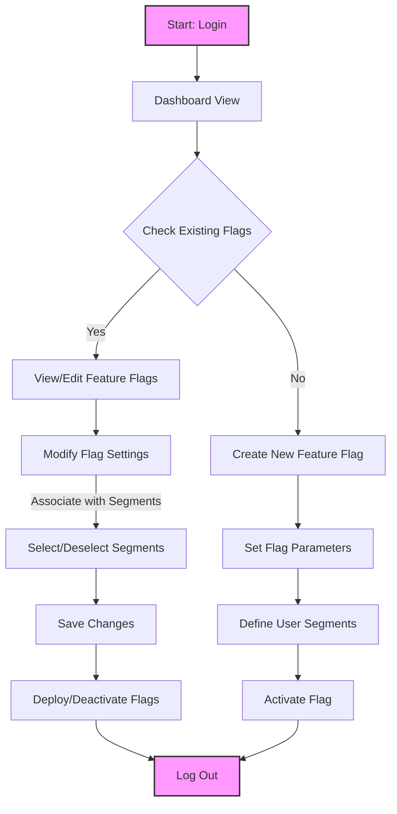
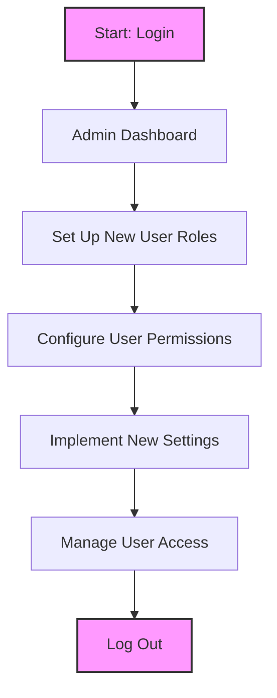
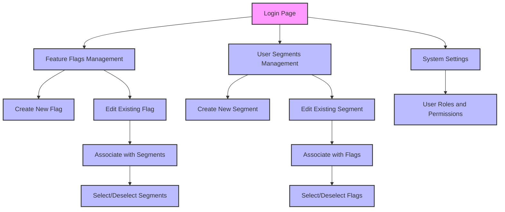

## Product Overview

### 1. **Purpose and Vision**
The Feature Flag Service aims to revolutionize how organizations manage feature rollouts, providing a robust platform that allows for granular control, real-time updates, and detailed performance tracking. The vision is to become an essential tool for any team implementing continuous delivery and integration practices. By enabling selective feature visibility and real-time management, the service uniquely positions itself in the market as not just a tool, but a strategic asset that enhances the agility and responsiveness of product development cycles. The expected impact on target users includes faster time-to-market, reduced risk associated with deploying new features, and enhanced ability to respond to user feedback and market changes.

### 2. **Target Audience**
The primary user segments of the Feature Flag Service include software developers, product managers, QA engineers, and operations teams within medium to large tech companies. These users often face the challenges of managing complex release cycles and require a solution that provides flexibility without compromising on stability. The service caters to these needs by offering a scalable, reliable way to manage feature flags across multiple environments, thus supporting teams in achieving smoother and more controlled deployments.

### 3. **Key Benefits**
- **Engagement**: Enhances user engagement by allowing teams to test and optimize new features based on real user data.
- **Efficiency**: Streamlines the feature release process, significantly reducing the time and resources required to manage deployments.
- **Cost Savings**: Minimizes the costs associated with delayed rollouts and rollback processes by reducing the likelihood of widespread issues affecting all users.

## Key Features

### 1. **Core Functionality**
- **Feature Flag Creation and Management**: Users can create, modify, and delete feature flags, controlling the visibility of features across different user segments and environments. Flags can be associated with multiple segments and vice versa, enabling versatile control over feature exposure.
- **Real-Time Updates**: Ensures that any changes made to the feature flags are instantly reflected across all platforms, enabling dynamic response to feedback and conditions.

### 2. **User Interaction Features**
- **Interactive Dashboards**: Provides a visual representation of the status of various feature flags, user segments, and their impacts, allowing for quick assessments and modifications.
- **Search Functions and Input Forms**: Facilitates easy navigation and management of feature flags and user segments through comprehensive search tools and simple input forms.

### 3. **Data Processing and Management**
- **Data Storage**: Safely stores data in compliance with industry standards. Enhances the relational data model to support many-to-many relationships between feature flags and user segments, allowing complex and flexible feature deployment strategies.

### 4. **Integration Capabilities**
- **WebSocket Integration**: Seamlessly integrates with other tools and platforms through WebSocket connections, supporting a variety of programming languages and frameworks.

### 5. **Security Features**
- **Authentication and Authorization**: Implements robust security protocols including OAuth and JWT for secure access control.
- **Data Privacy**: Ensures that all user data is handled and stored in accordance with privacy laws and regulations.

## Identification of User Roles and Contextual Use Cases

### 1. **End Users**
The primary end users of the Feature Flag Service are **developers** and **QA engineers** who interact with the platform daily to manage feature deployments. These users utilize the service to control which features are active in various environments, enabling them to test new functionalities with select user groups before a full rollout. This helps in identifying potential issues early and adjusting features based on real user feedback, ensuring a smoother transition to production.

### 2. **Administrators**
**Administrative users**, such as product managers and operations team leaders, play a crucial role in overseeing the use of the Feature Flag Service at an organizational or system-wide level. They set up high-level permissions and configurations, manage user roles and access, and ensure that the deployment of new features aligns with broader business objectives and compliance requirements. Administrators also monitor the overall health and performance of the system, making strategic decisions based on comprehensive analytics and reports provided by the service.

## Site Architecture

- **Login Page**: The entry point where users authenticate.
- **Manage Feature Flags**: From here, users can create new feature flags or edit existing ones. This leads to specific actions such as assigning user segments to flags.
- **Manage Segments**: This allows for the creation and editing of segments, with capabilities to assign feature flags to specific segments.
- **Admin Settings**: A separate area dedicated to administrators for managing user roles, permissions, and password.